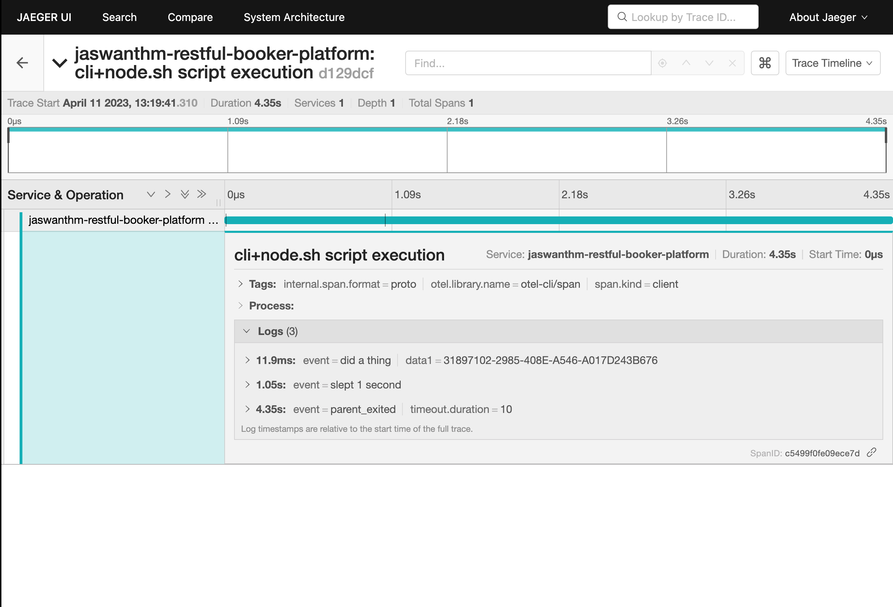

## Setup otel cli

```
brew tap equinix-labs/otel-cli
brew install otel-cli
```


## Run otel server

```
otel-cli server tui
```

## Run the script cli+node.sh
```
sh cli+node.sh
```

Running this script would do the following

1. Create a main trace in the background and export the TRACE_ID and SPAN_ID in the background. 

2. main.ts uses these env variables to create a new span with TRACE_ID and SPAN_ID as the parent trace.

3. Issue - Unable to see the span created by main.ts. The only span that's visible is the main span created within the cli+node.sh script itself using otel-cli. 

Any thoughts on why this could be ? Ta!



